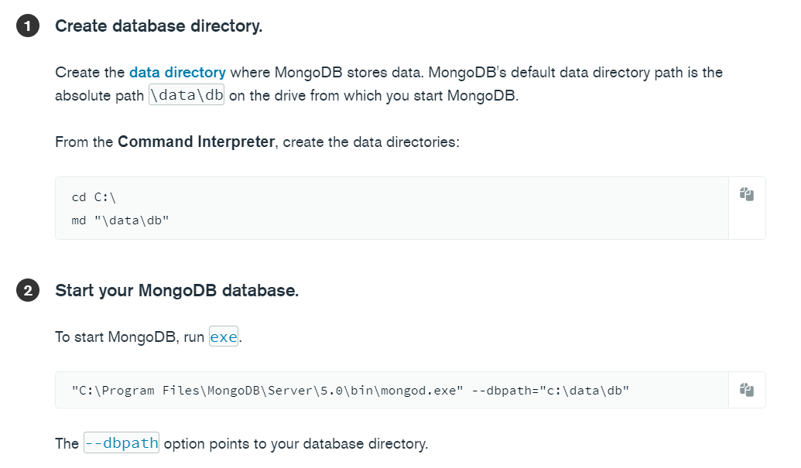

# MongoDB installation:
1. Go to mongodb website, and choose *community server*. (https://www.mongodb.com/try/download/community)
2. google *mongo manual* - (https://www.mongodb.com/docs/manual/administration/install-community/)
3. Create a folder under C drive named as *data*, and abar oitar moddhe *db* namok ekta folder rakhte hobe. amader db gula etai save hobe 

4. Download mongoDB compass : https://www.mongodb.com/try/download/compass 
